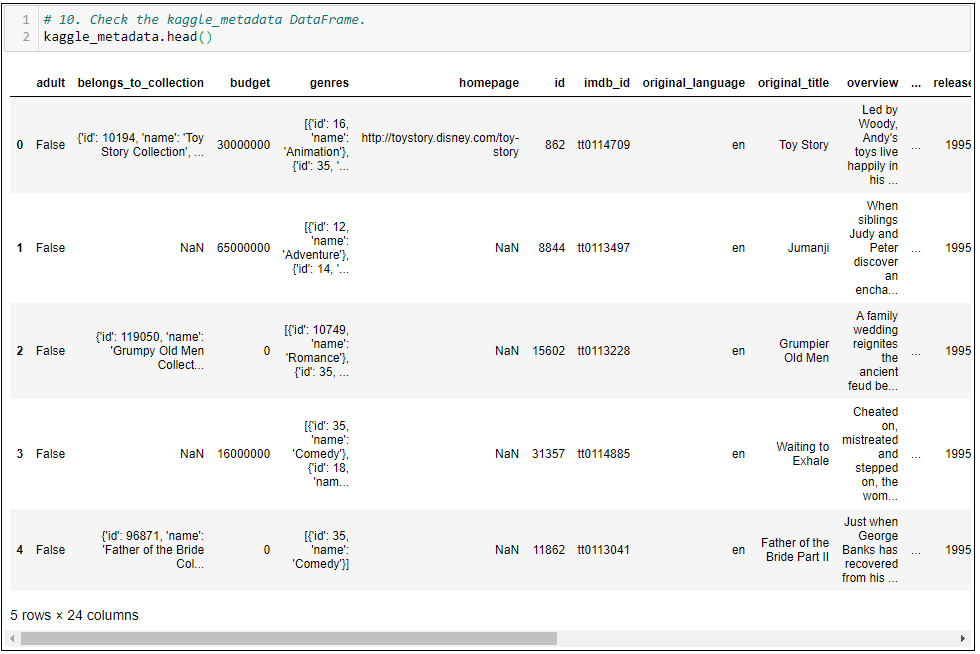
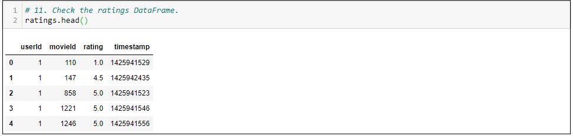
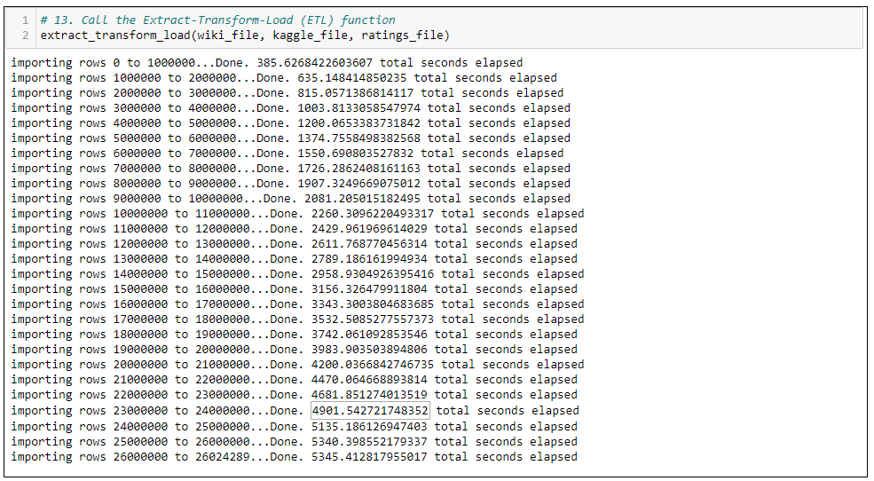
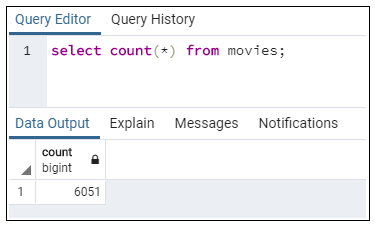
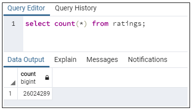

# Movies ETL

## Project Overview
Amazing Prime Video is a platform for streaming movies and TV shows on ***Amazing Prime***, the world's largest online retailer. The Amazing Prime video team would like to develop an algorithm which would predict which low-budget movie being released would become popular, so that they can buy the streaming rights at a bargain. 

To inspire the team, have some fun and connect with the coding community, Amazing Prime has decided to sponsor a Hackathon, providing a clean dataset of movie data and asking participants to predict the popularity pictures. 

Britta, a member of the Amazin Prime video team, has been tasked with creating the datasets for the Hackathons. There are two data sources, a scrape of **wikipedia** for all moviese released since 1990, and rating data from **MovieLens** website.
She will need to extract the data from the two sources, transform into one clean dataset and finally load that data into a SQL table.

Britta needs to organize the data from Wikipedia and MovieLens in a structured format before she can send it to SQL—and she's asked me to assist with this task.

## Purpose of this Assignment

Britta and I worked together to Extract-Transform-Load the data from the 2 source to PostgreSQL.

Now, Amazing Prime wants to create an automated pipeline that takes in new data, performs the appropriate transformations, and loads the data into existing tables. I’ll need to refactor the code that I used to create one function that takes in the three files — Wikipedia data, Kaggle metadata, and the MovieLens rating data — and performs the ETL process by adding the data to a PostgreSQL database.

## Assignment Steps

### Deliverable 1

1. In Step 1, create the function to read in the three files and give it a name.
2. In Step 2, read in the Kaggle metadata and MovieLens ratings CSV files as Pandas DataFrames.
3. In Step 3, open the Wikipedia JSON file and use the `json.load()` function to convert the JSON data to raw data.
4. In Step 4, read in the raw Wikipedia movie data as a Pandas DataFrame.
5. In Step 5, use the code provided to return the three DataFrames.
6. In Step 6, use the variables provided to create a path to the Wikipedia data, the Kaggle metadata, and the MovieLens rating data files.
7. In Step 7, set the three variables in Step 6 equal to the function created in Step 1.
8. In Step 8, set the DataFrames from the return statement equal to the file names in Step 6. In this step, you are reassigning the variables created in Step 6 to the variables in the return statement.
9. In Steps 9-11, check that all three files are converted to a DataFrame. 

    **Image 1 (below): wiki_movies_df**
    

    **Image 2 (below): kaggle_metadata**
    

    **Image 3 (below): ratings**
    

### Deliverable 2

1. In Step 1, add the code that your created for Britta for the clean movie function that takes in the argument "movie".
2. In Step 2, add the function you created in Deliverable 1 that reads in the three data files.
3. In Step 3, inside the function you created in Deliverable 1, remove the code that creates the `wiki_movies_df` DataFrame from the `wiki_movies_raw` file, then write a list comprehension that filters out TV shows from the `wiki_movies_raw` file.
4. In Step 4, write a list comprehension to iterate through the cleaned wiki movies list that you created in Step 3.
5. In Step 5, read in the cleaned movies list from Step 4 as a DataFrame.
6. In Step 6, write a `try-except` block that will catch errors while extracting the IMDb IDs with a regular expression string and dropping any `imdb_id` duplicates. If there is an error, capture and print the exception.
7. In Step 7, write a list comprehension to keep the columns that have non-null values from the DataFrame created in Step 5, then create a `wiki_movies_df` DataFrame from the list.
8. In Step 8, create a variable that will hold all the non-null values from the "Box office" column.
9. In Step 9, convert the box office data created in Step 8 to string values using the lambda and join functions.
10. In Step 10, write a regular expression to match the six elements of `form_one` of the box office data.
11. In Step 11, write a regular expression to match the three elements of `form_two` of the box office data.
12. In Step 12, add the `parse_dollars()` function.
13. In Step 13, add the code that cleans the box office column in the `wiki_movies_df` DataFrame using the `form_one` and `form_two` lists created in Steps 10 and 11, respectively.
14. In Step 14, add code that cleans the budget column in the `wiki_movies_df` DataFrame.
15. In Step 15, add code that cleans the release date column in the `wiki_movies_df` DataFrame.
16. In Step 16, add code that cleans the running time column in the `wiki_movies_df` DataFrame.
17. In Step 17, use the variables provided to create a path to the Wikipedia data, the Kaggle metadata, and the MovieLens rating data files.
18. In Step 18, set the three variables in Step 17 equal to the function created in Deliverable 1.
19. In Step 19, set the `wiki_movies_df` equal to the wiki_file variable.
20. In Step 20, check the `wiki_movies_df` DataFrame

**Image 4 (below): wiki_movies_df**

21. In Step 21, add the columns from `wiki_movies_df` DataFrame to a list, and check the list

**Image 5 (below): wiki_movies_df_columns_to_list.columns.to_list()**

### Deliverable 3

1. In Step 1, add the function you created in Deliverable 1 that reads in the three data files and creates the `kaggle_metadata` and `ratings` DataFrames.
2. Before Step 2, add all the code you wrote for Deliverable 2.
3. In Step 2, below the code that cleans the running time column in the `wiki_movies_df` DataFrame from Deliverable 2, add the code that cleans the Kaggle metadata.
4. In Step 3, merge the wiki_movies_df DataFrame and the `kaggle_metadata` DataFrames, then name the new DataFrame, `movies_df`.
5. In Step 4, drop unnecessary columns from the `movies_df` DataFrame.
6. In Step 5, add the fill_missing_kaggle_data() function that fills in the missing Kaggle data on the movies_df DataFrame.
7. In Step 6, call the `fill_missing_kaggle_data()` function with the `movies_df` DataFrame and the Kaggle and Wikipedia columns to be cleaned as the arguments.
8. In Step 7, filter the `movies_df` DataFrame to keep the necessary columns.
9. In Step 8, rename the columns in the `movies_df` DataFrame.
10. In Step 9, transform and merge the ratings DataFrame with the `movies_df` DataFrame, name the new DataFrame `movies_with_ratings_df`, then clean the `movies_with_ratings_df` DataFrame.
11. In Step 10, use the variables provided to create a path to the Wikipedia data, the Kaggle metadata, and the MovieLens rating data files.
12. In Step 11, set the three variables from Step 17 of Deliverable 2 equal to the function created in Deliverable 1.
13. In Step 12, set the DataFrames from the return statement after Step 9 equal to the file names in Step 11.
14. In Step 13, check that your `wiki_movies_df` DataFrame is the same as in Deliverable 2.
**Image 6 (below): wiki_movies_df**

15. In Step 14, check your `movies_with_ratings_df` DataFrame 

**Image 7 (below): movies_with_ratings_df**

16. In Step 15, check that your `movies_df` DataFrame looks like this image:

**Image 8 (below): movies_df**

### Deliverable 4

**Image 9 (below): Loading ratings to PostgresSQL**

**Image 10 (below): movies queries**

**Image 11 (below): ratings queries**

